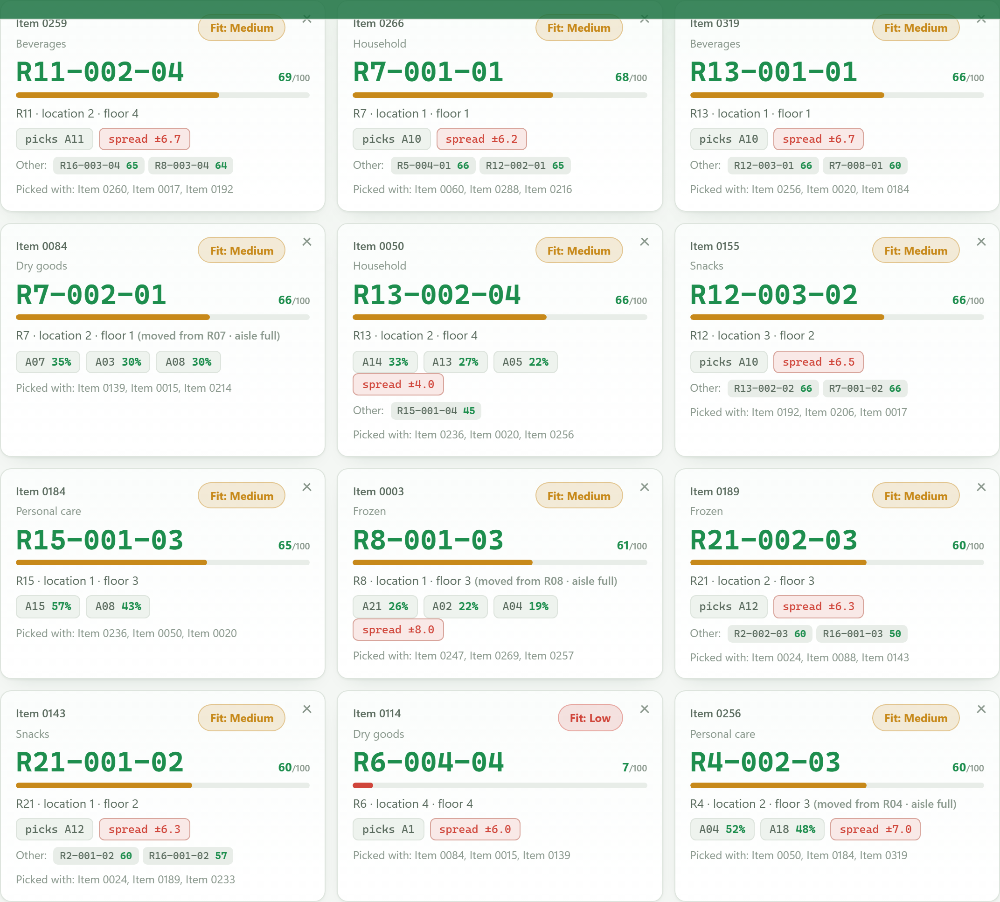
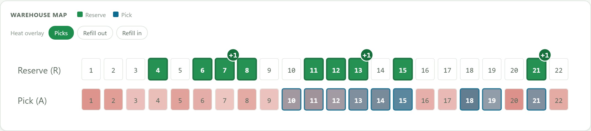
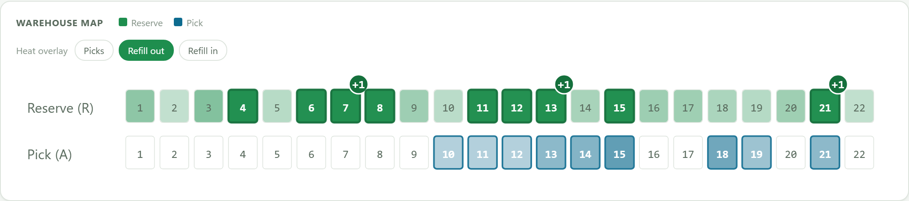
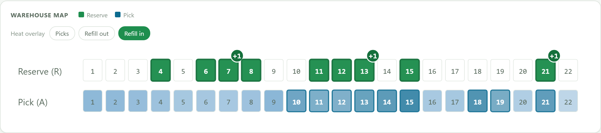
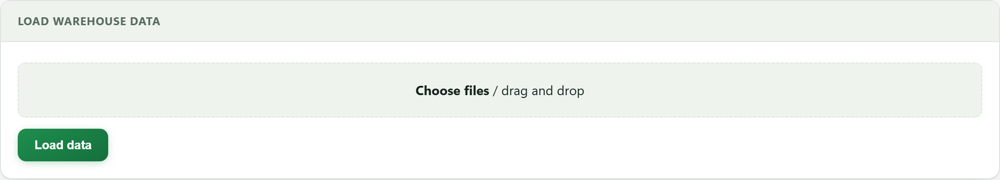
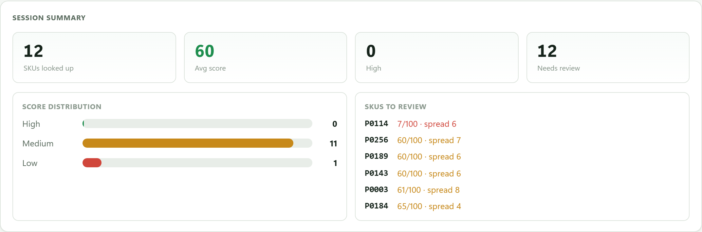
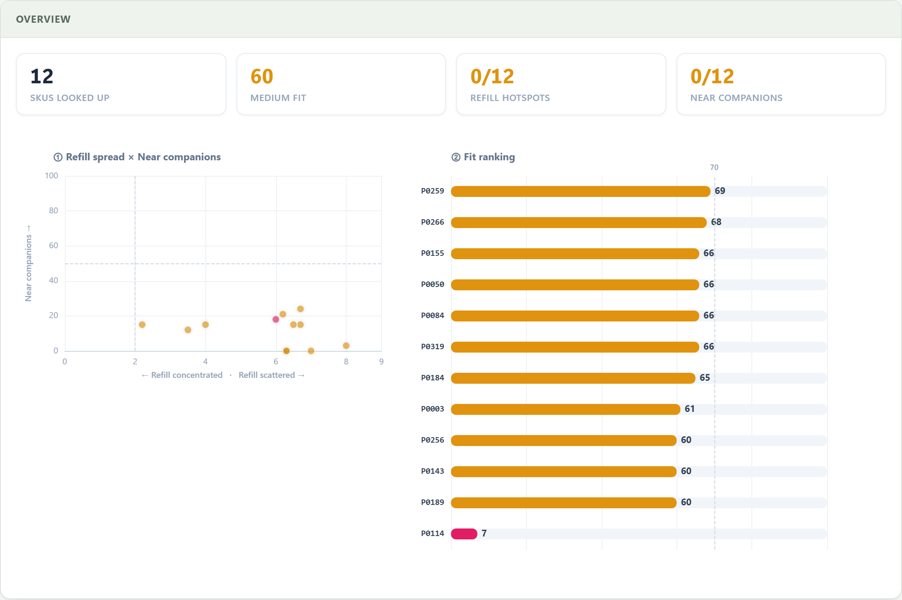
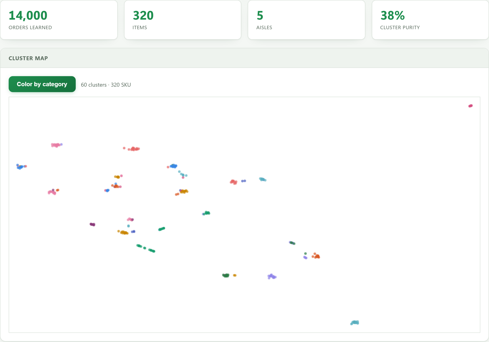
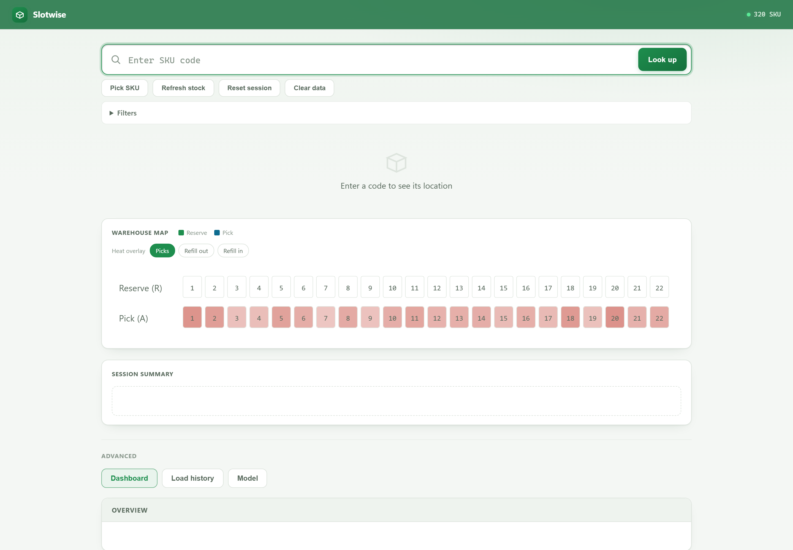

Picks a storage location for warehouse items, based on past order history.

The warehouse is split into two levels. Zone A sits on the low floors where pickers
work. Zone R sits above it and holds the reserve stock. Incoming goods go into R, and
when A runs low a forklift brings a pallet down. That move is called a refill.

The question this answers: given an item, which R aisle should it go to so the total
walking and driving over the next few months is smallest.

Slotwise learns that from the order log and writes out a location list you can feed
back into a WMS.



Paste in a batch of item codes and each one comes back with a cell, a fit score, the
pick aisles it serves, and the items it usually ships with.

## Scoring

Each candidate R aisle gets a score:

```
score = 0.6 x near_refill_target + 0.4 x near_companions
```

**near_refill_target** looks at where this item usually lands in zone A. Take the
**median** of that cluster of cells, not the mean. Travel distance here is an L1 norm,
and the point that minimizes total L1 distance is the median. The mean pulls the answer
off target whenever the cluster has a long tail.

**near_companions** looks at items that ship together. If two items keep showing up in
the same order, storing them far apart makes the picker cross the warehouse twice.
Companionship comes from Word2Vec over the order log, where each order is a sentence
and each item is a word.

The 0.6/0.4 split can be changed to suit your warehouse layout.

The map shows where the suggestions landed:







## Layout

```
config.py             reads the schema, holds global constants
schema.example.json   maps your WMS column and file names onto the fields used here

core/
  brain.py        picks the location: five branches by how much data backs the item,
                  aisle scoring, and simulated annealing to settle a whole batch
  engine.py       Word2Vec, KMeans, PCA, UMAP, training, backtest
  rmap.py         median of an item's zone A cluster, mapped to an R aisle
  refill.py       per-item refill cluster
  cell.py         picks the cell and floor inside an aisle, skipping locked cells
  weight.py       heavy items go to low floors
  route.py        measures pick travel for an order, with a TSP branch for comparison

data/
  loader.py       column detection, tolerant of odd files and encodings
  warehouse.py    schema mapping layer

web/
  app.py          Flask API
  router.py       works out what each uploaded CSV is
  dashboard.py    summary figures
  templates/index.html, static/

tools/
  retrain.py         rebuild the model
  heatmap.py         pick and refill counts per aisle
  compare_solver.py  check the heuristic against OR-Tools CP-SAT
```

## Running it

```bash
pip install -r requirements.txt
cp schema.example.json schema.json     # then edit it to match your columns
python web/app.py
```

Open http://127.0.0.1:5000 and upload five CSVs: pick history, refill log, location
list, stock, product list.



Slotwise ships with no data. It reads exports from your own WMS, and `schema.json` is
where you declare the real column and file names. Without that file it falls back to
the placeholder names in `schema.example.json`.

Rebuild the model after loading:

```bash
python tools/retrain.py
```

### Environment variables

| Variable | Default | Purpose |
|---|---|---|
| `SLOTWISE_SCHEMA` | `schema.json` | Point at a different schema file |
| `SLOTWISE_DATA` | `data_in/` | Directory holding the source CSVs |
| `SLOTWISE_CACHE` | `cache/` | Where the model and caches are written |
| `SLOTWISE_HOST` | `127.0.0.1` | Listen address |
| `SLOTWISE_PORT` | `5000` | Port |
| `SLOTWISE_DEBUG` | off | Set to `1` for Flask debug mode |

The `research/` scripts also read `SLOTWISE_WAREHOUSE`, `SLOTWISE_STATUS_DONE`,
`SLOTWISE_DELETED` and the `COL_*` / `F_*` variables. See `research/_common.py`.

## All functions





Word2Vec:



Full view of the system:


